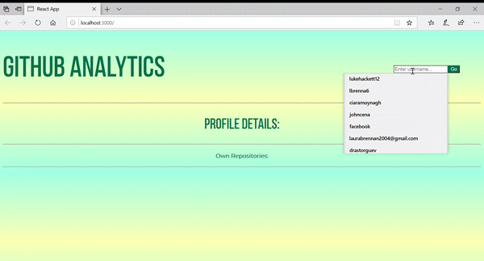

The project brief was to write a piece of software to interrogate the GitHub REST API v3

In the project directory, you can run:

### `npm start`

Runs the app in the development mode. 
Open [http://localhost:3000](http://localhost:3000) to view it in the browser.

The first step was to simply connect to the api. 

The next part of the project was to query some software engineering metrics from the api, 
amoutn of users forking a repository for example.
The idea is to visualise the data to give some insight into a users activity.

The Graphs included in this site were implemented using the D3.js library, a library used for graphing data. 
The graphs are shown on the screen showing languages used in a users repository. 
I used a pie chart and bar chart to show different visuals of this data. 

